## Introduction

This repository contains three algorithms intoduced in Prof. Liang Zhe's Optimization Theory and their simple application to Cutting and Packing Problem and Multi Commodity Network Flow Problem. 

Our code mainly based on [XpressOptimization](https://www.fico.com/fico-xpress-optimization/docs/latest/examples/python/GUID-E77AC35C-9488-3F0A-98B4-7F5FD81AFF1D.html)'s tutorial. In this readme file, we will firstly introduce the usage of XPressOptimization.

Source code：[Algorithms-and-Problems](algorithms-and-problems)

- [XPress Optimization](#xpress-optimization)
  * [Official](#official)
  * [Set Problem Step by Step](#set-problem-step-by-step)
  * [Directly Load Problem](#directly-load-problem)
  * [Change Constrain](#change-constrain)
- [Algorithms](#algorithms)
  * [Column Generation](#column-generation-1)
  * [DW Decomposition](#dw-decomposition-1)
  * [Bender Decomposition](#bender-decomposition-1)
- [Problems](#problems)
  * [Cutting Stock Problem（todo）](#cutting-stock-problem-todo-)
  * [Multi Commodity Network Flow Problem（todo）](#multi-commodity-network-flow-problem-todo-)

## XPress Optimization

### Official

> FICO® Xpress Optimization is integrated into the FICO® Decision Management Suite and is comprised of four components:
>
> 1. ~~FICO® Xpress Insight enables businesses to rapidly deploy optimization models as powerful applications.~~
> 2. ~~FICO® Xpress Executor provides standalone support for optimization execution services.~~
> 3. **FICO® Xpress Solver provides optimization algorithms and technologies to solve linear, mixed integer and non-linear problems.**
> 4. ~~FICO® Xpress Workbench is an Integrated Development Environment (IDE) for developing optimization models, services and complete solutions.~~

Xpress's Python interface is powerful and we maintain that it's also more convenient than pulp. In this part, we will introduce how to use Xpress to solve LP problem.

### Set Problem Step by Step

```python
# 变量
x = xp.var()
y = xp.var()

# 约束
cons1 = x + y >= 2
upperlim = 2*x + y <= 3

# 定义问题，增加变量、目标函数、约束
p = xp.problem()
p.addVariable(x, y)
p.setObjective((x-4)**2 + (y-1)**2)
p.addConstraint(cons1, upperlim)
```

```python
Minimize
 17 - 8 C1 - 2 C2 + [ 2 C1^2 + 2 C2^2 ] / 2

Subject To
R1: C1 + C2 >= 2 
R2: 2 C1 + C2 <= 3 

Bounds
```

### Directly Load Problem

```python
# 添加变量、约束和目标函数
p.loadproblem("",  # probname
              ['G', 'G', 'E', 'L'],  # qrtypes
              [-2.4, -3, 4, 5],  # 约束方程的右侧
              None,  # range
              [3, 4, 5],  # 目标函数
              [0, 2, 4, 8],  # mstart
              None,  # mnel
              [0, 1, 2, 3, 0, 1, 2, 3],  # mrwind
              [1, 1, 1, 1, 1, 1, 1, 1],  # dmatval
              [-1, -1, -1],  # 约束的下界
              [3, 5, 8],  # 约束的上界
              colnames=['x1', 'x2', 'x3'],  # 变量的定义
              rownames=['row1', 'row2', 'row3', 'constr_04'])  # 约束的名称
```

```
Minimize
 3 x1 + 4 x2 + 5 x3

Subject To
row1: x1 + x3 >= -2.4 
row2: x1 + x3 >= -3 
row3: x2 + x3 = 4 
constr_04: x2 + x3 <= 5 

Bounds
-1 <= x1 <= 3 
-1 <= x2 <= 5 
-1 <= x3 <= 8 
```

### Change Constrain

```python
x = xp.var()
y = xp.var()

cons1 = x + y >= 2
upperlim = 2*x + y <= 3

p = xp.problem()

p.addVariable(x, y)
p.setObjective((x-4)**2 + (y-1)**2)
p.addConstraint(cons1, upperlim)

p.chgcoef(cons1, x, 3)  # 修改x在cons1的系数为3
p.chgcoef(1, 0, 4)      # 修改第1个约束upperlim中第0个变量y的系数为4
```

## Algorithms

### Column Generation

Code: [column generation.py](algorithms-and-problems/column_generation.py)

Author: Prof. Liang Zhe

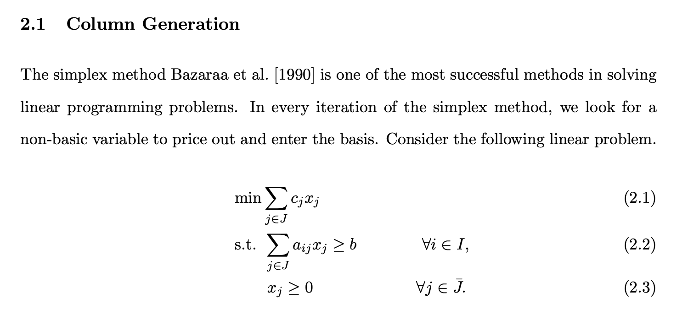

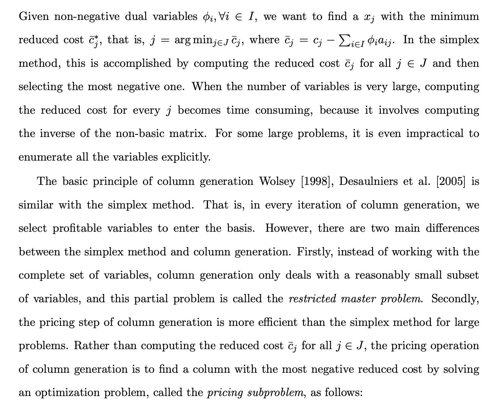

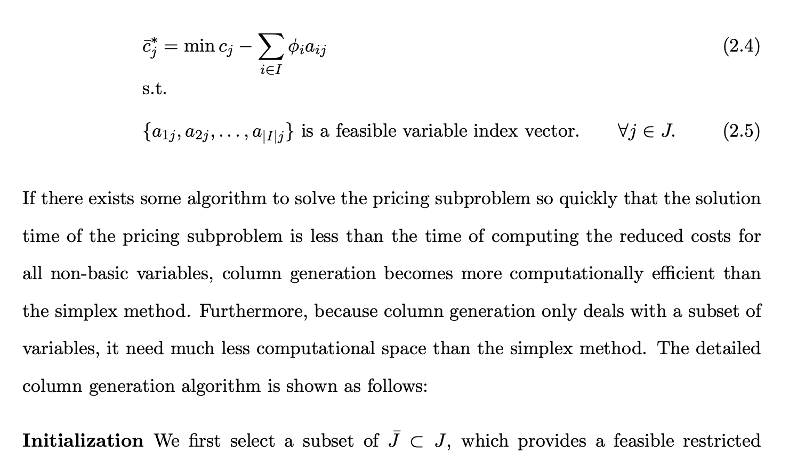

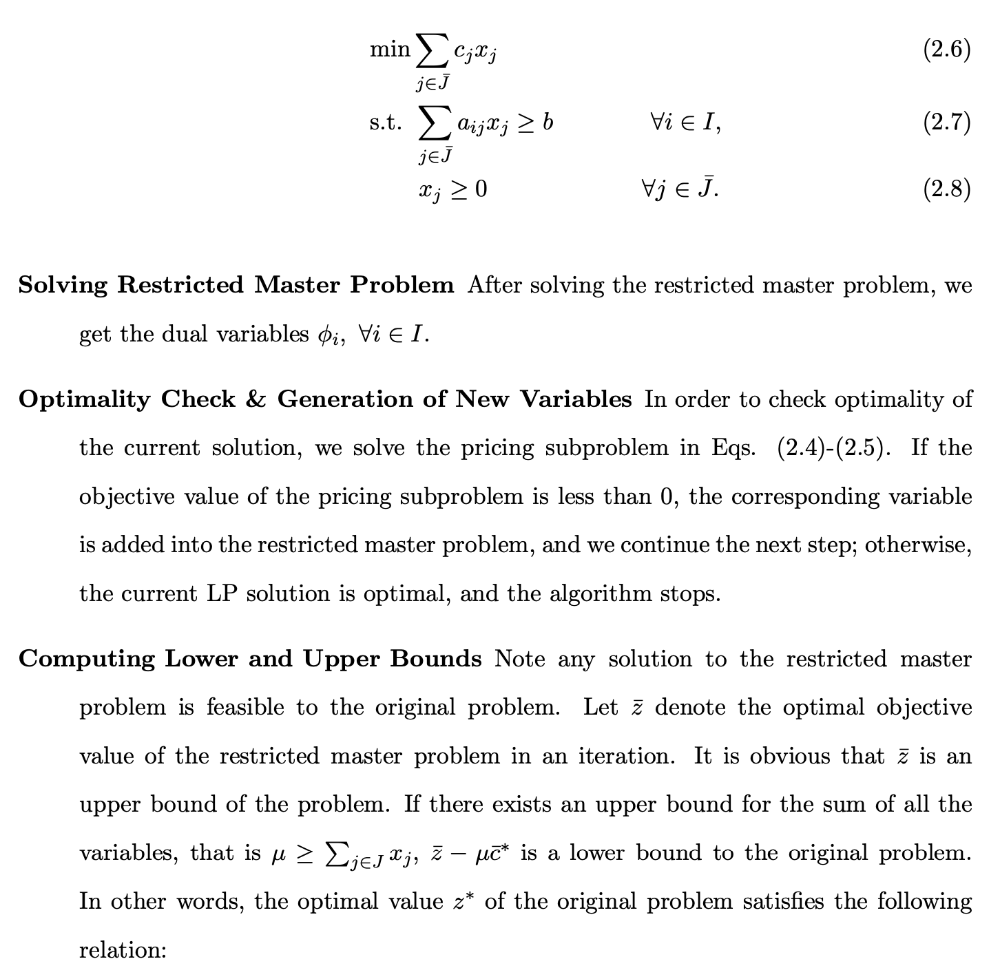

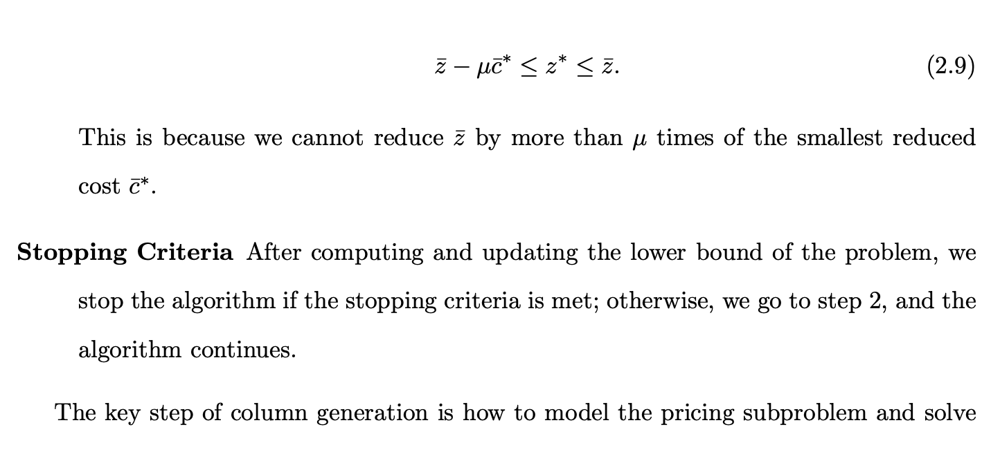

### DW Decomposition

Code: [dw decomposition.py](algorithms-and-problems/dw_decomposition.py)

Author: Prof. Liang Zhe

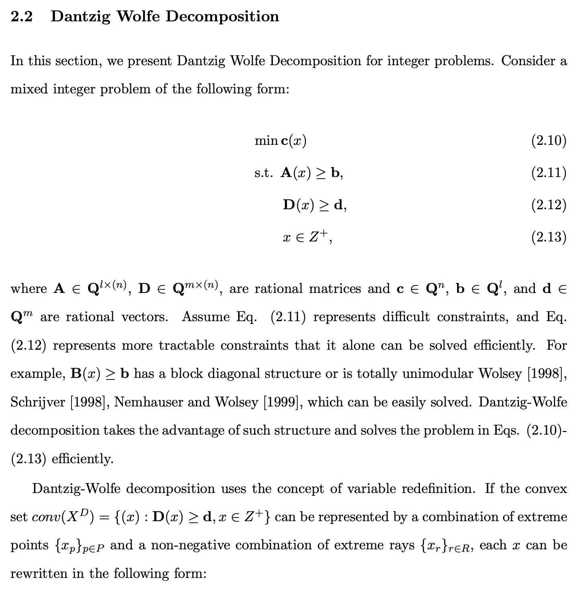

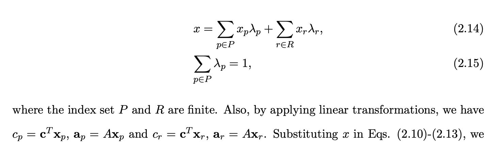

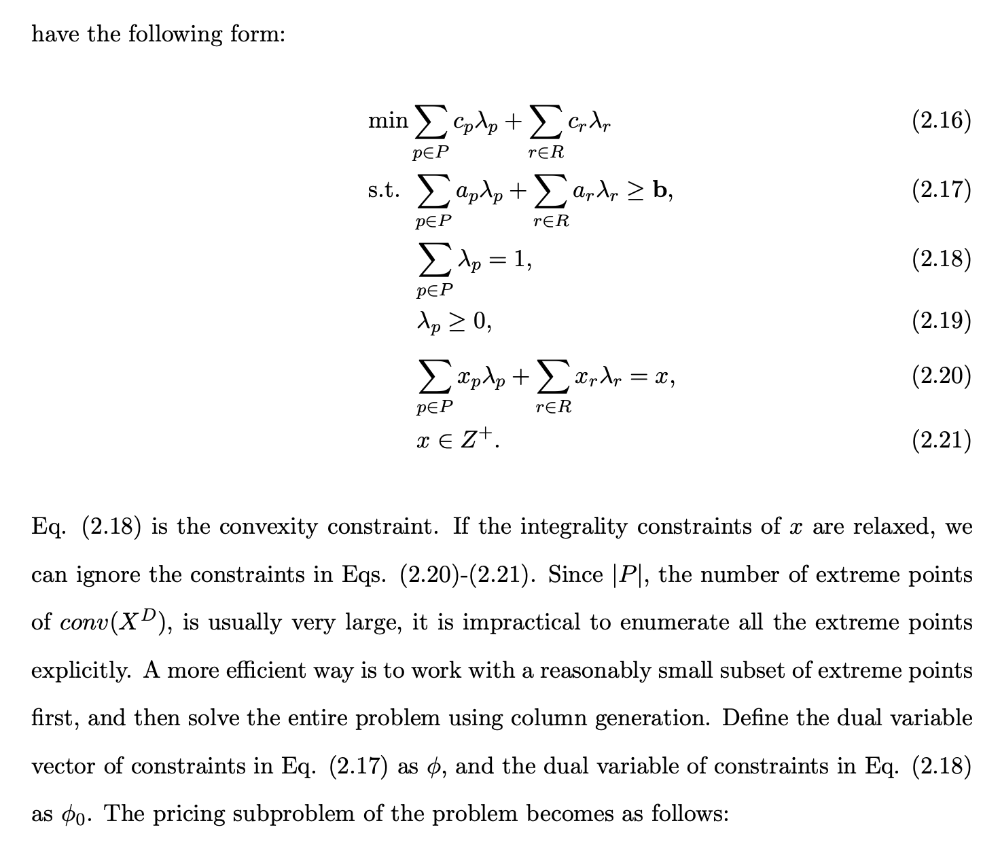

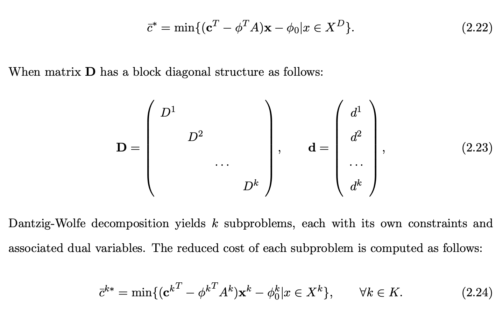

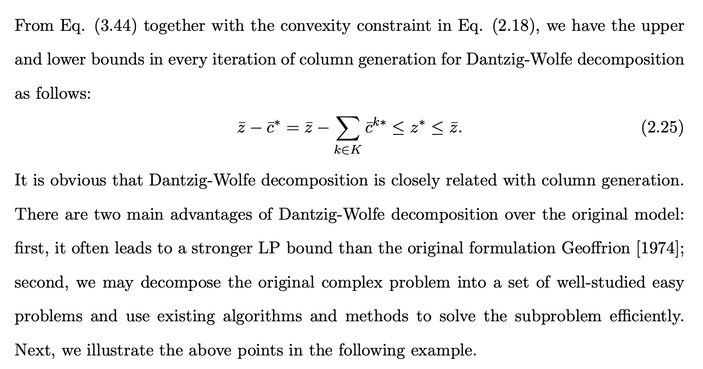

### Bender Decomposition

Code: [bender decomposition.py](algorithms-and-problems/bender_decomposition.py)

**Bender Decomposition is a algorithm for MIP problem.**

1. Problem can be formulated to have only one continous var with a lot more constraints
2. Because only a small number of constraints are useful, we can drop most of them.

**Procedure**

1. Start with a relaxed BMP with no constraints or just a few, sovle to optimal
2. We also have an upper bound Zub
3. Solve the dual problem to get u, it may be 
   1. Infeasible(Dual Unbounded), generate v to find violated feasibility cut
   2. has a solution, add u related optimality cut, we has a lower bound

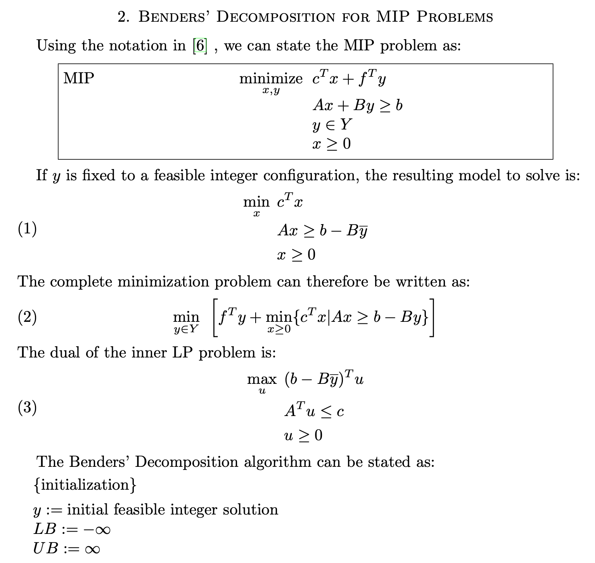

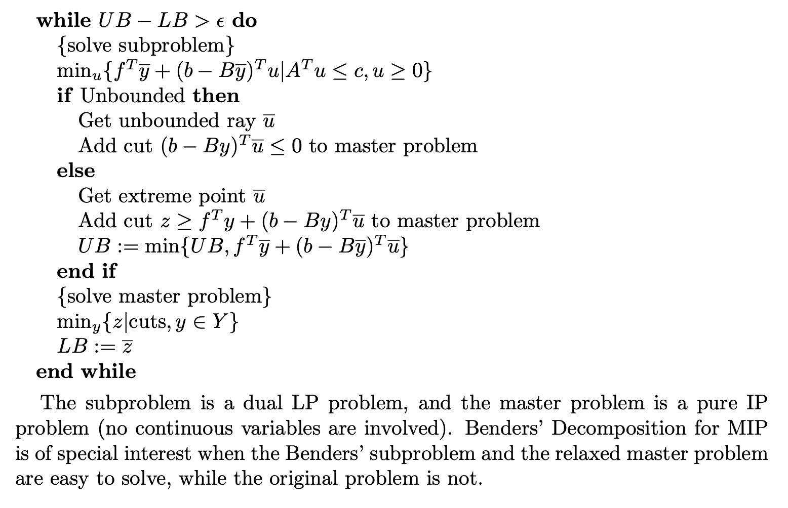

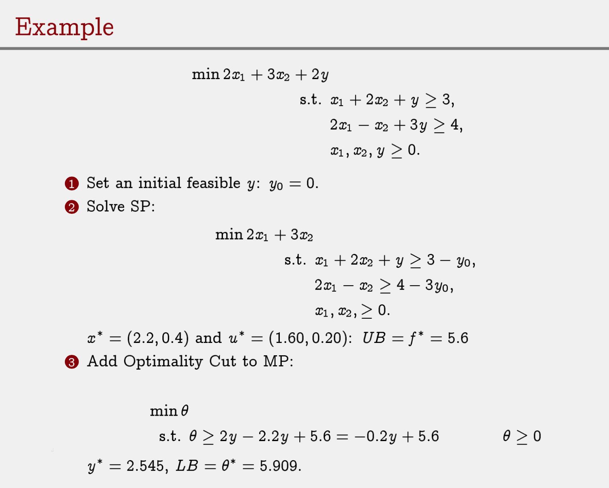

## Problems

### Cutting Stock Problem（todo）

Column Generation


### Multi Commodity Network Flow Problem（todo）

DW Decomposition


